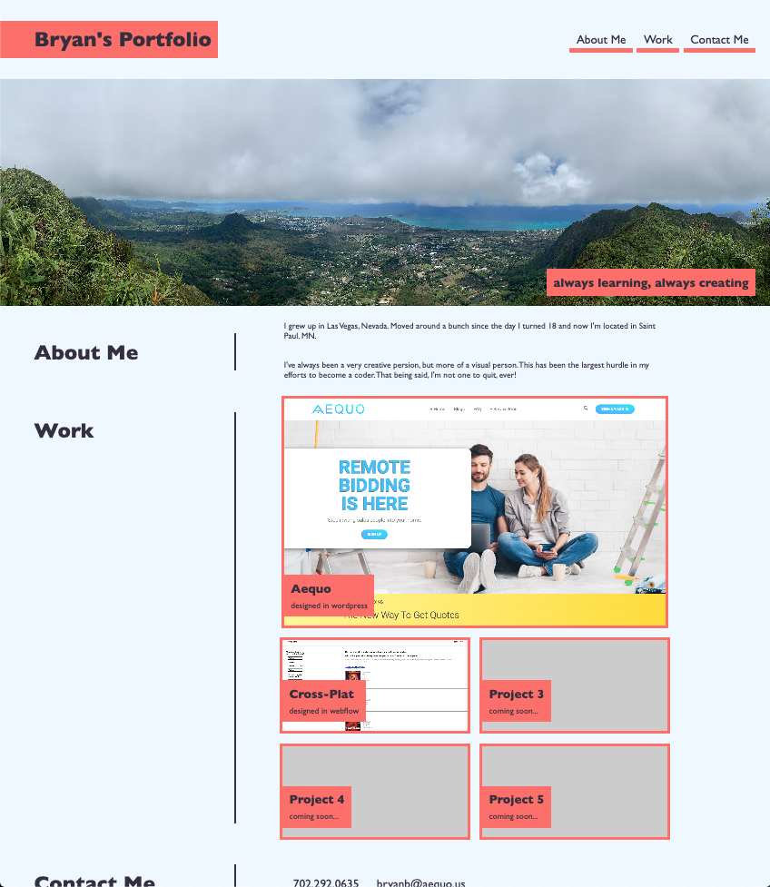

# 02 Advanced CSS: Portfolio

Link to deployed app: https://bryanborek.github.io/02-My-Portfolio/
Link to the project Github: https://github.com/BryanBorek/02-My-Portfolio

I've recreated the example portfolio to the best of my abilities (though I have made some minor color and image alterations).

1. I have included my name and a photo from a trip I took to Hawaii.
2. When clicking on a link the user is brought to the appropriate section of the page.
3. The first project is larger than the latter four.
4. When the user clicks on an image they are brought to the deployed application.
5. When the page is resized, the page adapts to the users viewport.

